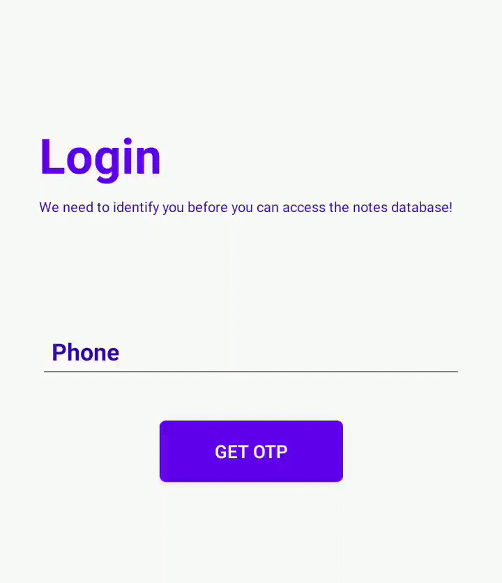

# PhoneEditText-Android

PhoneEditText makes it easy for you to handel country codes in Phone number fields of your android application.
PhoneEditText identifies your country and sets its respective dial code automatically.

## How to use?



### Jitpack
Add JitPack to your **Project** level **build.gradle** file

			allprojects {
				repositories {
					...
					maven { url 'https://jitpack.io' }
				}
			}
			
Add the Phone Edit Text Dependency to **App** level **build.gradel** file

		dependencies {
					implementation 'com.google.android.material:material:1.1.0-alpha09'
					implementation 'com.github.amannirala13:PhoneEditText-Android:Tag'
			}


### Jcenter
Add the dependency to **App** level **build.gradel** file

    implementation 'com.google.android.material:material:1.1.0-alpha09'
    implementation 'com.asdev.PhoneEditText-Android:PhoneEditText-Android:Tag'

#### Version Tag
[](https://app.codacy.com/manual/asdevofficial/PhoneEditText-Android?utm_source=github.com&utm_medium=referral&utm_content=amannirala13/PhoneEditText-Android&utm_campaign=Badge_Grade_Dashboard)
[](https://jitpack.io/#amannirala13/PhoneEditText-Android)

### Using in XML layout
```xml
 <com.asdev.phoneedittext.PhoneEditText
        android:layout_width="match_parent"
        android:layout_height="wrap_content"

        />
```
### Get Dial code
```java
import com.asdev.phoneedittext.PhoneEditText;
...
...
...
PhoneEditText myPhoneEditText = findViewById(R.id.YOUR_EDIT_TEXT_ID)
String code = myPhoneEditText.getDIAL_CODE();
/* return type of getDIAL_CODE() is String*/
```

------------


### Advantages
- No drop down lists.
- No user based inputs
- No predictive definations of dial codes.
- Dial code can be changed upon the wish of the user
- Full support of TextInputEditText

### Limitations
- Sets the country code to default +91 when the device is on a WiFi network

### Support
[](https://www.paypal.me/amannirala13)
[](https://app.fossa.com/projects/git%2Bgithub.com%2Famannirala13%2FPhoneEditText-Android?ref=badge_shield)


## License
[](https://app.fossa.com/projects/git%2Bgithub.com%2Famannirala13%2FPhoneEditText-Android?ref=badge_large)